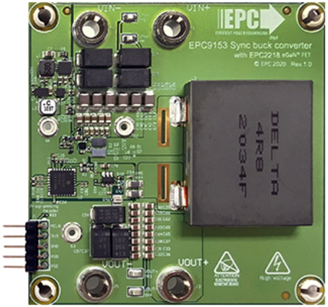
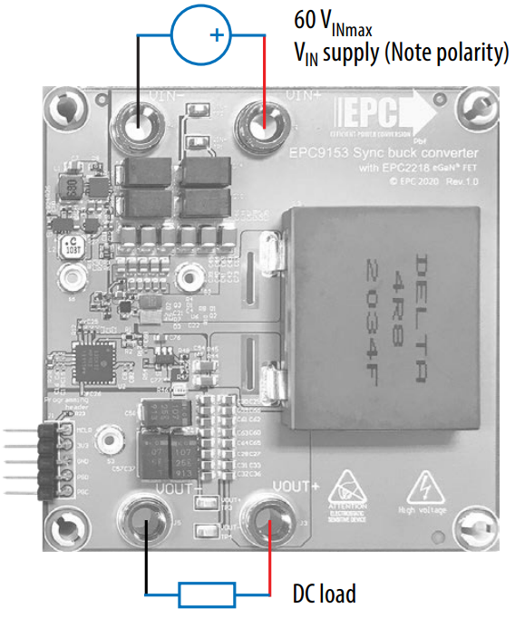
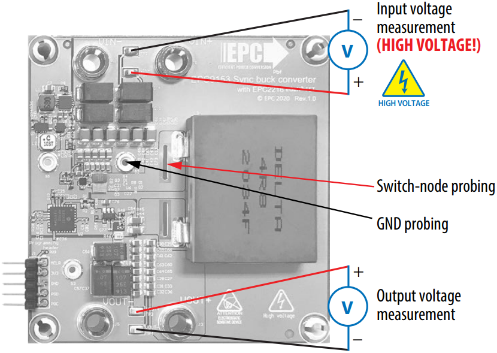
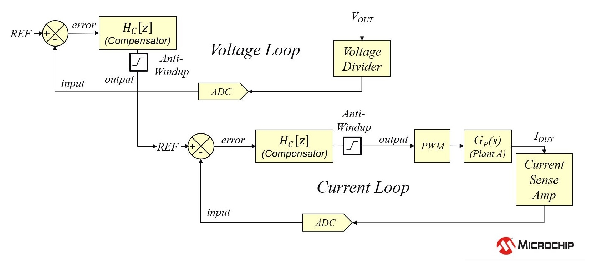

 

## EPC9153 250W High Performance Synchronous Buck Converter Average Current Mode Control Firmware
**High Performance Synchronous Buck Converter Average Current Mode Control**

  

    Top View  
    	
  

## Summary
This code example demonstrates an average current mode control implementation for dsPIC33CK. It has specifically been developed for the EPC9153 high performance synchronous buck converter.

The board starts up the buck converter automatically when power is applied to the board, hence increasing the output voltage from 0 to its nominal value. The startup procedure is controlled and executed by the power controller state machine and includes a configurable startup procedure with power-on delay, ramp up period and power good delay before dropping into constant regulation mode.
An additional fault handler routine continuously monitors incoming ADC data and peripheral status bits and shuts down the power supply if the input voltage is outside the defined maximum range of 41.5 V to 59.5 V (UVLO/OVLO) or if the output voltage is more than +/-0.5 V out of regulation for more than 10 milliseconds. 
 

#### Product Features:
  - Input Voltage: 44 V to 60 V
  - Output Voltage: 12 to 20 V DC (20 V default setting) 
  - Switching Frequency: 400 kHz
  - Control Frequency: 400 kHz
  - Cross-Over Frequency: ~10 kHz 
  - Phase Margin: ~ 60°
  - Gain Margin: ~ 12 dB

## Related Documentation
##### Firmware Documentation
  - [EPC9153 Online Firmware Documentation](coming soon)

##### Firmware Documentation
  - [EPC9153 250W High Performance Synchronous Buck Converter Reference Design Product Website](https://www.microchip.com/DevelopmentTools/ProductDetails/PartNO/EPC9153)
  - [EPC9153 Reference Design Quick Start Guide (QSG)](https://epc-co.com/epc/documents/guides/EPC9153_qsg.pdf)
  - [EPC9153 Reference Design Schematics](https://epc-co.com/epc/documents/schematics/EPC9153_Schematic.pdf)

##### Device Support
*Featured Microchip Technology Products:*
- [dsPIC33CK32MP102 Product Website](https://www.microchip.com/dsPIC33CK32MP102)
  - [dsPIC33CKxxMP10x Device Family Data Sheet](https://www.microchip.com/DS70005363)
  - [dsPIC33CKxxMP10x Device Family Silicon Errata and Data Sheet Clarification](https://www.microchip.com/DS80000809)
- [MCP6C02 Shunt Amplifier Product Website](https://www.microchip.com/MCP6C02)
  - [MCP6C02 Zero-Drift, High-Side Current Sense Amplifier Data Sheet](https://www.microchip.com/DS20006129)

*Featured Efficient Power Conversion (EPC) Products:*
- [EPC2218: 100 V, 241 A Enhancement-Mode GaN Power Transistor](https://epc-co.com/epc/Products/eGaNFETsandICs/EPC2218.aspx)
  - [EPC2218 Data Sheet](https://epc-co.com/epc/Portals/0/epc/documents/datasheets/EPC2218_datasheet.pdf)
- [EPC2038 Enhancement Mode Power Transistor with Integrated Reverse Gate Clamp Diode](https://epc-co.com/epc/Products/eGaNFETsandICs/EPC2038.aspx)
  - [EPC2038 Data Sheet](https://epc-co.com/epc/Portals/0/epc/documents/datasheets/EPC2038_datasheet.pdf)

##### MPLAB® X Integrated Development Environment (IDE)
  - [Requires MPLAB® X IDE, Version v5.40 or later](https://www.microchip.com/mplabx)
    - [Download latest version of MPLAB® X IDE for Windows](https://www.microchip.com/mplabx-ide-windows-installer)
    - [Download latest version of MPLAB® X IDE for Linux](https://www.microchip.com/mplabx-ide-linux-installer)
    - [Download latest version of MPLAB® X IDE for MAC OS](https://www.microchip.com/mplabx-ide-osx-installer)

##### MPLAB® XC16 C-Compiler
  - [Requires MPLAB® XC16 Compiler, Version v1.50 or later](https://www.microchip.com/xc16)
    - [Download latest version of MPLAB® XC16 Compiler for Windows](https://www.microchip.com/mplabxc16windows)
    - [Download latest version of MPLAB® XC16 Compiler for Linux](https://www.microchip.com/mplabxc16linux)
    - [Download latest version of MPLAB® XC16 Compiler for MAC OS](https://www.microchip.com/mplabxc16osx)

##### MPLAB® X PowerSmart™ Digital Control Library Designer
  - [Optional: PowerSmart&trade; - Digital Control Library Designer, v0.9.12.642 or later (Pre-Release Version)](https://areiter128.github.io/DCLD/)
    - [Download latest version of PowerSmart&trade; - Digital Control Library Designer for Windows](https://github.com/areiter128/DCLD/archive/release.zip)

## Hardware Used
The EPC9153 high performance synchronous buck converter module provides all required interfaces to program and debug the dsPIC33CK32MP102 DSC as well as test points and banana jack connectors for easy and safe handling of the kit during bench tests. The EPC9153 QSG provides detailed operating procedure instructions.

## Setup
The board comes programmed and ready to be used when unpacked. No reprogramming of the target device is required to operate the board unless features or settings such as the nominal output voltage or start-up timing need to be modified. 

  

      
	</a>
   
  EPC9153 Test Connections - Top View
  

  

      
	</a>
   
  EPC9153 Measurement Connection
  

In case firmware based features need to be changed, the Microchip dsPIC33CK controller can be re-programmed using the in-circuit serial programming port (ICSP) available on the RJ-11 programming interface as well as the 5-pin header. These interfaces support all of Microchip’s in-circuit programmers/debuggers, such as MPLAB® ICD4, MPLAB® REAL ICE or MPLAB® PICkit4 and previous derivatives. See [EPC9153 Quick Start Guide](https://epc-co.com/epc/documents/guides/EPC9153_qsg.pdf) for details.

## Operation
The converter is starting up automatically when more than 41.5 V DC are applied across the input terminals of the EPC9153.  Please read the [EPC9153 Quick Start Guide](https://epc-co.com/epc/documents/guides/EPC9153_qsg.pdf) to get detailed information about the requirements for setup and operation of this reference design.

## Firmware Quick-Start Guide

##### 1) Buck Converter State Machine

The state machine goes through the following steps in chronological order:

a) Initialization

In this step the control loop parameters are reset to their defaults, PWM outputs are turned off but the PWM is still running, continuously triggering the ADC to keep sampling input and output voltage as well as board temperature.

b) Reset
This is the 'fall-back' state from which the buck converter will be restarted once it has been started successfully and has been shut down due to a fault condition (e.g. input under/over voltage or over temperature condition)

c) Standby
After RESET, the state machine waits for all fault flags to be cleared and the enable and GO bits to be set.

d) Power-On Delay (POD)
Once the buck converter has been cleared the state machine will execute the startup procedure starting with the Power On Delay. This is just a simple delay during which the converter will remain inactive but the fault handler will observe the values generated by the ADC for occurring fault conditions.

e) Launch Voltage Ramp
After the Power-On delay has expired, input and output voltage will be measured. In case the converter output is pre-biased (voltage = non-zero), the power controller will be 'pre-charged' with an artificial control history and PWM output to softly ramp up the output voltage from its most recent level. 

f) Voltage Ramp-Up
Now the digital feedback loop and PWM are enabled and the closed loop system reference value is incremented with every execution of the state machine (100 µsec interval). The control loop has been adjusted to operate with a cross-over frequency of >10 kHz matching the maximum perturbation frequency allowed to keep the control system stable.  

g) Power Good Delay
After the reference voltage has been increased to the pre-defined nominal level, the state machine switches over into the Power Good Delay period. This is another, simple delay where the control loop is in steady state waiting for the delay period to expire.

h) Online
After the Power Good Delay has expired, the converter drops into nominal operation. In this condition it continuously observes the reference value for changes. Should any other part of the firmware change the controller reference, the state machine will softly tune into the new level instead of hard-switching the reference. 

i) Suspend/Error
If the power controller is shut down and reset by external commands (e.g. fault handler detecting a fault condition or through user-interaction), the state machine is switching into the SUSPEND state, which disables the PWM outputs and control loop execution, clears the control histories and resets the state machine back to RESET

##### 2) Cycle-by-Cycle Control Loop

This firmware uses two digital type II controllers to close the feedback loop in average current mode control. The controller is comprised of two cascaded loops. The outer voltage feedback loop determines the output voltage error and calculates the required reference for the inner average current feedback loop. The inner average current loop determines the most recent deviation between the new reference and most recent feedback signal and adjusts the PWM duty cycle to meet the power demand and correct the output voltage error. The numeric output of each loop is checked against defined minima and maxima thresholds and, when necessary, clamped to these user-defined thresholds to protect the hardware and prevent loop saturation. 

  

      
	</a>
   
  EPC9153 control loop
  

This control loop can be turned on/off by using the ENABLE bit in the STATUS word of the cNPNZ_t controller data structure. The adaptive loop gain modulation is permanently active as soon as the control loop is enabled.

##### 3) Digital Controller Design

The control loop source code is configured and generated by the PowerSmart&trade; - Digital Control Library Designer (DCLD) software.

This additional design software is available for download on Github Pages:

  - [PowerSmart&trade; Digital Control Library Designer Github Page](https://areiter128.github.io/DCLD)

Once installed, the controller configuration can be modified. The most recent configuration can be opened from within the MPLAB X® IDE by right-clicking on the respective control loop configuration file 'xxx_loop.dcld' located in the *Important Files* folder of the Project Manager. Each control loop is configured in its individual configuration file named 'v_loop.dcld' for voltage loops and 'i_loop.dcld' for current loops. 
When right-clicked, select 'Open In System' to open the configuration in PowerSmart&trade; DCLD. 

Please refer to the user guide of PowerSmart&trade; DCLD which is included in the software and can be opened from the help menu of the application.

##### 4) User Control

No user control interface has been added to the firmware. Any change to the firmware and fundamental operation of the reference design, including reprogramming of the nominal output voltage can be done by editing the hardware-specific values in the hardware description header file 'epc9153_r10_hwdescr.h' located in 'Project Manager => Header Files/Config'

Converter settings in this file are defined as physical values such as Volt, Ampere, Ohm, etc. Each defined value is converted into binary numbers by so-called macros, at compile time. Thus, users do not have to convert values manually.

##### Example:
To program the converter to provide a nominal output voltage different from the 12 V DC set by default, follow these steps:

  - Open the project in MPLAB X® IDE
  - Navigate to 'Header Files/Config/epc9153_r10_hwdescr.h' using the Project Manager on the left of the main window
  - Change the give settings as desired
  - Build the program
  - Remove power from the input of the EPC9153 board
  - Connect a valid ICSP programming device (e.g. MPLAB ICD4, MPLAB PICkit4) to the PC and the EPC9153 board
  - Program the device with the target device being powered by the debugger/programmer
  - Disconnect the ICSP programming device from the EPC9153 board
  - Apply valid input voltage across the input terminals of EPC9153 and observe the output of the EPC9153 reference design

The setting for the nominal output voltage is set using these defines

    #define BUCK_VOUT_NOMINAL           (float)20.000  // Nominal output voltage
    #define BUCK_VOUT_TOLERANCE_MAX     (float)0.500   // Output voltage tolerance [+/-]
    #define BUCK_VOUT_TOLERANCE_MIN     (float)0.100   // Output voltage tolerance [+/-]

###### Please note:
The tolerance settings above include the transient response at a maximum load step. The value for maximum output voltage tolerance 'BUCK_VOUT_TOLERANCE_MAX' is observed by the fault handler. Should the output voltage reading divert from the most recent reference voltage value by more than the given range, the converter will be shut down and a REGULATION ERROR will be indicated. The power supply will automatically recover as soon as the fault condition has been cleared and the recovery delay period specified by BUCK_REGERR_RECOVERY_DELAY, declared in the EPC9148 hardware description header file, has expired. The fault trip sensitivity can be adjusted by changing the BUCK_REGERR_TRIP_DELAY declaration.

(line numbers given may be subject to change)

##### 5) Power Plant Measurement Support

This code examples includes an alternative, proportional control loop which is commonly used during measurements of the frequency response of the power plant. When the following define is set to TRUE, the common main control loop is replaced by the proportional controller.

    app_power_control.c, line 33:   #define PLANT_MEASUREMENT   false

###### PLEASE NOTE:
PROPORTIONAL CONTROLLERS ARE BY DEFAULT UNSTABLE AND NOT SUITED TO REGULATE THE OUTPUT OF A POWER SUPPLY UNDER NORMAL OPERATING CONDITIONS. DURING A PLANT MEASUREMENT IT IS MANDATORY THAT INPUT VOLTAGE AND LOAD REMAIN STABLE AND DO NOT CHANGE. 

FOR MORE INFORMATION ABOUT HOW TO CONDUCT A POWER PLANT MEASUREMENT, PLEASE REFER TO SECTION 6.1 OF THE PowerSmart&trade; DCLD USER GUIDE.

_________________________________________________
(c) 2020, Microchip Technology Inc.

